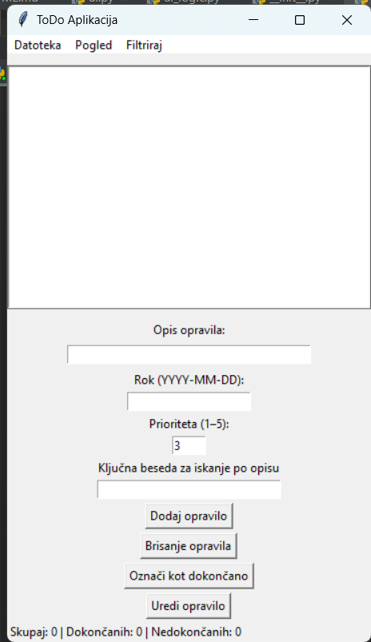

# ✅ ToDo Aplikacija

Preprosta **ToDo aplikacija** v Pythonu z dvema načinoma shranjevanja podatkov:  
- **JSON datoteka**  
- **SQLite baza**  

Aplikacija ponuja tako **ukazno vrstico (CLI)** kot tudi **grafični vmesnik (GUI)**. Projekt je modularno zasnovan in testno pokrit z **pytest** testi.

---

## 🚀 Funkcionalnosti
- ➕ Dodajanje opravil  
- 📝 Urejanje opravil (opis, datum, prioriteta)  
- ❌ Brisanje opravil  
- ✅ Označevanje opravil kot dokončana  
- 📅 Razvrščanje po datumu  
- ⭐ Razvrščanje po prioriteti  
- 🔎 Iskanje po opisu (neobčutljivo na velike/male črke)  
- 📊 Statistika (vsa, opravljena, nedokončana, zamujena)  
- 💾 Shranjevanje in nalaganje v JSON datoteke ali SQLite bazo  

---

## 📂 Struktura projekta
```
.
├── main.py
├── gui.py
├── controller.py
├── app_factory.py
├── ui.py
├── ui_logic.py
├── gitignore
├── todo/                # glavni paket za logiko
│   ├── task.py
│   ├── repository.py
│   ├── todoapp.py
│   ├── ToDoAppSQL.py
│   └── napake.py
├── data/                # mapa za datoteke (npr. JSON, SQLite baze)
│   ├── tasks.json
│   └── database.db
├── tests/               # testi
│   ├── test_task.py
│   ├── test_todoapp.py
│   ├── test_controller.py
│   └── ...
└── README.md


---

## ▶️ Zagon aplikacije

### 1. CLI način
```bash
python main.py
```
Program te vpraša, ali želiš uporabljati **JSON** ali **SQLite** shranjevanje. Nato lahko z menijem upravljaš opravila.

### 2. GUI način
```bash
python gui.py
```
Odpre se **Tkinter okno**, kjer lahko z gumbi dodajaš, brišeš, urejaš in filtriraš opravila.

---

## 🧪 Testiranje
Testi so napisani v **pytest** in pokrivajo:
- delo z `todoapp.py` (JSON implementacija),  
- delo z `ToDoAppSQL.py` (SQLite implementacija),  
- integracijo med `controller` in `ui_logic`.  

Za zagon testov:
```bash
pytest
```

---

## 💡 Primer uporabe (CLI)
```
--- TO-DO MENI ---
1. Dodaj opravilo
2. Prikaži opravila
3. Izbriši opravilo
4. Označi opravilo kot dokončano
5. Razvrščanje po prioriteti
6. Razvrščanje po datumu
7. Iskanje po opisu
8. Statistika
...
```

---

## 📸 GUI pogled

---

## ⚠️ Znane omejitve
- V GUI so bile odpravljene manjše napake pri obravnavi izjem (npr. napačen ID pri urejanju).  

---

## 👩‍💻 Avtor
Projekt pripravljen kot vaja iz **objektno usmerjenega programiranja**, **testiranja** in **uporabe podatkovnih baz v Pythonu**.  
